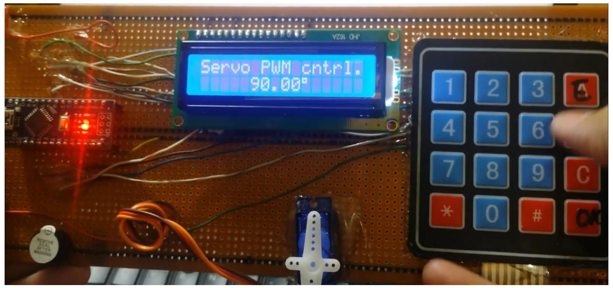

## Task 27: Servo Motor Controller

#### Overview
This task involves creating a **servo motor controller** that allows the user to move a servo motor to a desired position by entering an angle via a **4x4 keypad**. The current angle and the input prompt will be displayed on a **16x2 LCD**. 

#### Instructions

1. **Keypad Input:**
   - Allow the user to enter the desired angle (0-180 degrees) using the **4x4 keypad**.
   - Provide feedback by making a short beep sound from the buzzer whenever a key is pressed.

2. **LCD Display:**
   - Use a **16x2 LCD** to display the current angle.
   - Update the display to show the angle being entered by the user.

3. **Angle Validation:**
   - If the entered angle is outside the range of 0-180 degrees, the program should ignore it.
   - In this case, sound a long beep on the buzzer to indicate an error.

4. **Non-blocking Beep:**
   - Implement the beep functionality using **timer interrupts** and flags instead of using `delay`, ensuring the code remains non-blocking.

5. **Final Product:**
   - Aim for a design similar to the example shown in this video: [Servo Motor Controller](https://www.youtube.com/watch?v=CHUjnqX7LyA&ab_channel=ChipSoulTechnology%28SMC-Private%29Limited).

---

### Future Tasks

1. **CPU Usage Calculation**
2. **Data Types:**
   - `uint8_t`, `uint16_t`
3. **Main.h File and File Inclusion**
4. **Structs and Unions**
5. **Memory Overlap Using Unions**
6. **Saving Memory by Using Bit Fields**
7. **Water Pump Controller**
8. **Temperature Controller**
9. **Temperature Controlled Fan Using PWM**
10. **Speed Trap**
11. **Short Beep When a Key is Pressed on the Keypad**
12. **LED Matrix Task**
13. **NRF24L01**
14. **LCD12864**
15. **Five-Wire Four-Phase Stepper Motor ULN2003D**
16. **DC Motor (PWM)**
17. **Infrared Receiver Module**

#### Hardware Studies
1. **DC5V to 3.3V Study**
2. **Crystal Oscillator Circuit**
3. **Reset Circuit Study**
4. **USB to TTL Circuit Study**

